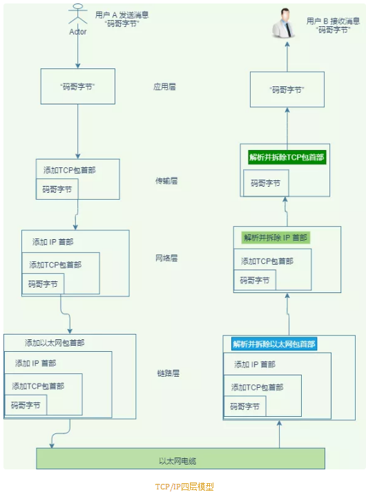

# 终极解密输入网址按回车到底发生了什么

**大致流程**
- URL 解析，解析 http 协议、端口、资源地址。
- DNS 查询：首先查询本地 host，再访问 DNS 服务器将 域名解析成 ip 地址。
- 建立 TCP 连接。
- 服务器收到请求后处理，并且构造响应返回给客户端。
- 客户端接收 HTTP 报文响应。
- 渲染页面，最后有可能会四次挥手断开连接，也可能不会而是复用连接。

**重点来了**
- 如何理解 TCP 的三次握手与四次挥手？每次握手客户端与服务端是怎样的状态？
- 为何挥手会出现 2MSL，遇到大量 Socket 处在 TIME_WAIT 或者 CLOSE_WAIT 状态是什么问题？
- 三次握手与四次挥手的过程是怎样的？
- HTTP 的报文格式又是怎样的？

>**URL 解析**
- url 遵守的规则是这个样子
```
scheme://host.domain:port/path/filename
```

- 每个名词的含义如下解释：
   - scheme 定义应用层协议类型，比如 http、https、 ftp 等；
   - host 定义域主机（http 的默认主机是 www）；
   - domain  定义因特网**域名**，比如 segmentfault.com；
   - port 主机的端口，http 默认是 80, https 默认是 443；
   - path 服务器上的资源路径；
   - filename - 定义文档/资源的名称；

>**DNS 查询**
- 浏览器不能直接通过域名找到服务器，只能通过 IP 地址。
- 那浏览器是如何通过域名查询到我们输入的 url 对应的 IP 呢？
   - 浏览器缓存：按照一定频率缓存 DNS 数据。
   - 操作系统缓存：如果浏览器缓存好啊不到记录则去操作系统中找。
   - 路由缓存：路由器 DNS 缓存。
   - ISP 的 DNS 服务器：ISP 是互联网服务提供商(Internet Service Provider)的简称，ISP 有专门的 DNS 服务器应对 DNS 查询请求。
   - 根服务器：ISP 的 DNS 服务器还找不到的话，它就会向根服务器发出请求，进行递归查询（DNS 服务器先问根域名服务器.com 域名服务器的 IP 地址，然后再问 .baidu 域名服务器，依次类推）

>**TCP 连接建立与断开**
- 通过域名解析出 IP 地址以后就要建立 TCP/IP 连接了。
- TCP/IP 分为四层，每一层都会加上一个头部再发送给下一层。到了接收方后，对应的每一层则把对应层的头部解析拆除，丢上上一层，跟发送端的过程反过来。

<div align="center">
 
</div>

>>**应用层：发送 HTTP 请求**
   - 浏览器从地址栏得到服务器 IP，接着构造一个 HTTP 报文，其中包括：
      - 请求行包含请求方法、URL、协议版本

      - 请求报头(Request Header)：由 “关键字: 值”对组成，每行一对，关键字与值使用英文 “:” 分割

      - 请求体：请求参数，并不是所有的请求有又请求参数。一般 get 参数 的格式 `name=tom&password=1234&realName=tomson`,也可以将参数放在 `body` 里面。

>>**传输层：TCP 传输报文**
   - 在传输报文之前会先建立 TCP/IP 连接，也就是后面我们要说的三次握手。

   - 在这一层解决了数据可靠传输、及流量控制、拥塞控制。 
>>>#### 可靠传输
   - 对于发送方发送的数据，接收方在接受到数据之后必须要给予确认，确认它收到了数据。如果在规定时间内，没有给予确认则意味着接收方没有接受到数据，然后发送方对数据进行重发。

- TCP的可靠传输是通过确认和超时重传的机制来实现的，而确认和超时重传的具体的实现是通过以字节为单位的滑动窗口机制来完成。 

#### TCP拥塞控制
TCP协议通过**慢启动**机制、**拥塞避免**机制、**加速递减**机制、**快重传和快恢复**机制来共同实现拥塞控制。

#### 流量控制
- 采用通知窗口实现对发送端的流量控制，通知窗口大小的单位是字节。TCP通过在TCP数据段首部的窗口字段中填入当前设定的接收窗口(即通知窗口)的大小，用来告知对方 '我方当前的接收窗口大小'，以实现流量控制。

- 通信双方的发送窗口大小由双方在连接建立的时候商定，在通信过程，双方可以动态地根据自己的情况调整对方的发送窗口大小。

**网络层：IP 协议查询 MAC 地址**
将数据段打包，并加入源及目标的 IP 地址，并且负责寻找传输路线。判断目标地址是否与当前地址处于同一网络中，是的话直接根据 Mac 地址发送，否则使用路由表查找下一跳地址，以及使用 ARP 协议查询它的 Mac 地址。