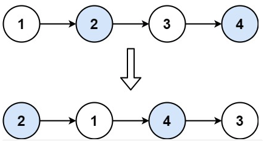
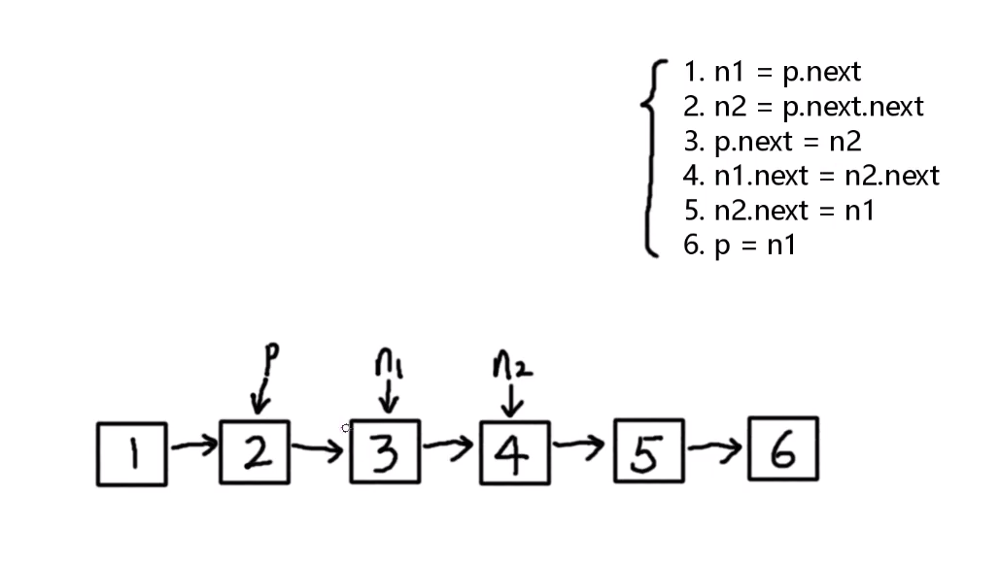
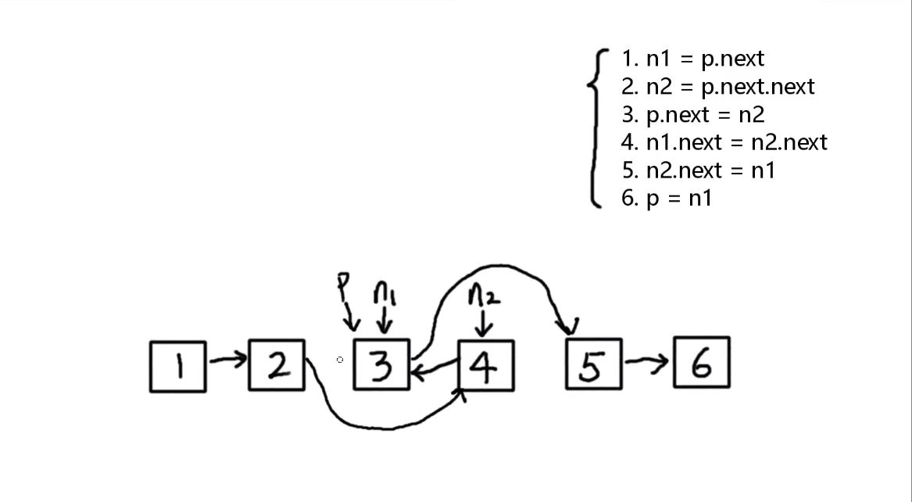

# 24. 两两交换链表中的节点
#### 难度 中等

::: tip
来源：力扣（LeetCode）

[https://leetcode-cn.com/problems/swap-nodes-in-pairs/][1]

[1]:https://leetcode-cn.com/problems/swap-nodes-in-pairs/
:::

给定一个链表，两两交换其中相邻的节点，并返回交换后的链表。

**你不能只是单纯的改变节点内部的值**，而是需要实际的进行节点交换。

**示例1:**

<div align="center">
 
</div>

```
输入：head = [1,2,3,4]
输出：[2,1,4,3]
```

**示例2:**  
```
输入：head = []
输出：[]
```

**示例3:**  
```
输入：head = [1]
输出：[1]
```

思路：  
1. n1=p.next
2. n2=p.next.next
3. p.next=n2
4. n1.next=n2.next
5. n2.next=n1
6. p=n1
<div align="center">
 
</div>
<div align="center">
 
</div>

``` js
/**
 * Definition for singly-linked list.
 * function ListNode(val, next) {
 *     this.val = (val===undefined ? 0 : val)
 *     this.next = (next===undefined ? null : next)
 * }
 */
/**
 * @param {ListNode} head
 * @return {ListNode}
 */
var swapPairs = function(head) {
    let dummy = new ListNode();
    dummy.next = head;
    let current = dummy; // 定义一个当前指针
    // 遍历链表，保证两个相邻的节点都不为null的前提下继续遍历
    while(current.next !==null && current.next.next !== null) {
        let n1 = current.next;
        let n2 = current.next.next;
        current.next = n2;
        n1.next = n2.next;
        n2.next = n1;
        current = n1;
    } 
    return dummy.next;
};
```
参考:

[B站的 up主： js老毕](https://www.bilibili.com/video/BV18Z4y1T7Kk?from=search&seid=17363545073957070168)


``` js
// 解法2：递归的方式
/**
 * Definition for singly-linked list.
 * function ListNode(val) {
 *     this.val = val;
 *     this.next = null;
 * }
 */
/**
 * @param {ListNode} head
 * @return {ListNode}
 */
var swapPairs = function(head) {
    if(!head || !head.next) return head;
    let three = swapPairs(head.next.next);
    let second = head.next;
    second.next = head;
    head.next = three;
    return second;
};
```