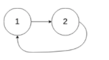

# 141. 环形链表
#### 难度 简单

::: tip
来源：力扣（LeetCode）

[https://leetcode-cn.com/problems/linked-list-cycle/][1]

[1]:https://leetcode-cn.com/problems/linked-list-cycle/
:::

给定一个链表，判断链表中是否有环。

如果链表中有某个节点，可以通过连续跟踪 next 指针再次到达，则链表中存在环。 为了表示给定链表中的环，我们使用整数 pos 来表示链表尾连接到链表中的位置（索引从 0 开始）。 如果 pos 是 -1，则在该链表中没有环。**注意：pos 不作为参数进行传递**，仅仅是为了标识链表的实际情况。

如果链表中存在环，则返回 true 。 否则，返回 false 。

**进阶：**

你能用 O(1)（即，常量）内存解决此问题吗？

**示例1:**

<div align="center">
 
</div>

```
输入：head = [3,2,0,-4], pos = 1
输出：true
解释：链表中有一个环，其尾部连接到第二个节点。
```

**示例2:**  
<div align="center">
 
</div>  
```
输入：head = [1,2], pos = 0
输出：true
解释：链表中有一个环，其尾部连接到第一个节点。
```

**示例3:**  
<div align="center">
 
</div>   
```
输入：head = [1], pos = -1
输出：false
解释：链表中没有环。
```

思路：  
快慢指针从头开始
快指针每次向前走2步，慢指针每次向前走一步，
如果它们会在某一点相遇的话，说明链表中有环
反之，说明链表中没有环，


``` js
// 解法1：快慢指针法 ，目前这个方法在现在的leetcode中运行 超时，使用下面的简化版吧
/**
 * Definition for singly-linked list.
 * function ListNode(val) {
 *     this.val = val;
 *     this.next = null;
 * }
 */

/**
 * @param {ListNode} head
 * @return {boolean}
 */
var hasCycle = function(head) {
    // 如果链表是空链表的话
    if(!head) return false;
    let slow = head,fast = head; // 定义2个指针都放在头部
    // fast 没有走到头，fast会走2步
    while(fast.next !== null && fast.next.next !== null) {
        // slow 往前走一步
        slow = head.next;
        // fast 往前走两步
        fast = head.next.next;
        // 判断 slow 和 fast 是否重合
        if(slow === fast) { // 重合 说明有环
            return true;
        }
    }
    // 如果循环走完都没有找到环，就return false
    return false;
};
```
参考:

[B站的 up主： js老毕](https://www.bilibili.com/video/BV1NA411Y7AX?from=search&seid=11220986985206010024)


``` js
// 解法1：快慢指针法
/**
 * Definition for singly-linked list.
 * function ListNode(val) {
 *     this.val = val;
 *     this.next = null;
 * }
 */

/**
 * @param {ListNode} head
 * @return {boolean}
 */
var hasCycle = function(head) {
  let fast = head;
  let slow = head;
  while (fast) {                        
    if (fast.next == null) return false; 
    slow = slow.next;                 
    fast = fast.next.next;             
    if (slow == fast) return true;   
  }
  return false;     
};
```