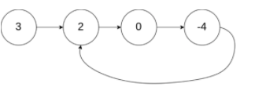

# 142. 环形链表II
#### 难度 中等

::: tip
来源：力扣（LeetCode）

[https://leetcode-cn.com/problems/linked-list-cycle-ii/][1]

[1]:https://leetcode-cn.com/problems/linked-list-cycle-ii/
:::

给定一个链表，返回链表开始入环的第一个节点。 如果链表无环，则返回 null。

为了表示给定链表中的环，我们使用整数 pos 来表示链表尾连接到链表中的位置（索引从 0 开始）。 如果 pos 是 -1，则在该链表中没有环。**注意，pos 仅仅是用于标识环的情况，并不会作为参数传递到函数中**。

**说明**：不允许修改给定的链表。

**进阶：**

你能用 O(1)（即，常量）内存解决此问题吗？

**示例1:**

<div align="center">
 
</div>

```
输入：head = [3,2,0,-4], pos = 1
输出：返回索引为 1 的链表节点
解释：链表中有一个环，其尾部连接到第二个节点。
```

**示例2:**  
<div align="center">
 
</div>  
```
输入：head = [1,2], pos = 0
输出：返回索引为 0 的链表节点
解释：链表中有一个环，其尾部连接到第一个节点。
```

**示例3:**  
<div align="center">
 
</div>   
```
输入：head = [1], pos = -1
输出：返回 null
解释：链表中没有环。
```

思路：  
快慢指针从头开始
快指针每次向前走2步，慢指针每次向前走一步，
如果它们会在某一点相遇的话，说明链表中有环
反之，说明链表中没有环，


``` js
/**
 * Definition for singly-linked list.
 * function ListNode(val) {
 *     this.val = val;
 *     this.next = null;
 * }
 */

/**
 * @param {ListNode} head
 * @return {ListNode}
 */
var detectCycle = function (head) {
  let slow = head;
  let fast = head;
  while (fast) {
    if (fast.next == null) { // fast.next走出链表了，说明无环
      return null;
    }
    slow = slow.next;        // 慢指针走一步
    fast = fast.next.next;   // 快指针走两步
    if (slow == fast) {      // 首次相遇
      fast = head;           // 首次相遇 后 让快指针回到头节点
      while (true) {         // 开启循环，让快慢指针相遇
        if (slow == fast) {  // 相遇，在入环处
          return slow;
        }
        slow = slow.next;
        fast = fast.next;    // 快慢指针都走一步
      }
    }
  }
  return null;
};

```
参考:

[leetcode 题解](https://leetcode-cn.com/problems/linked-list-cycle-ii/solution/141ti-de-kuo-zhan-ru-guo-lian-biao-you-huan-ru-he-/)

``` js
// 方法2： 哈希表的方式
/**
 * Definition for singly-linked list.
 * function ListNode(val) {
 *     this.val = val;
 *     this.next = null;
 * }
 */

/**
 * @param {ListNode} head
 * @return {ListNode}
 */
var detectCycle = function (head) {
  if(!head) return null;
  // 1. 设置哈希映射
  const map = new Map();

  // 2. 设置开始位置
  let index = -1;

  // 3. 设置链表
  while (head) {

    // 4. 每次遍历索引 + 1
    index++;

    // 5. 如果这个节点不曾出现，那就设置它
    if (!map.has(head)) {
      map.set(head, index);
    } else { // 6. 如果出现过，那就返回索引
      return head;
    }

    // 7. 逐步演进
    head = head.next;
  }

  // 8. 如果链表无环，返回结果 -1
  return head;
};


// 再优化下
/**
 * Definition for singly-linked list.
 * function ListNode(val) {
 *     this.val = val;
 *     this.next = null;
 * }
 */

/**
 * @param {ListNode} head
 * @return {ListNode}
 */
var detectCycle = function (head) {
    if(!head) return head;
    let map = new Map();
    let index = 0;
    while(head){
        if(map.has(head) == false){
            map.set(head, index);
        } else {
            return head;
        }
        index++;
        head = head.next;
    }
    return head;
};
```

参考:

[leetcode 题解](https://leetcode-cn.com/problems/linked-list-cycle-ii/solution/javascript-ha-xi-biao-xiang-jin-zhu-shi-by-jslia-2/)