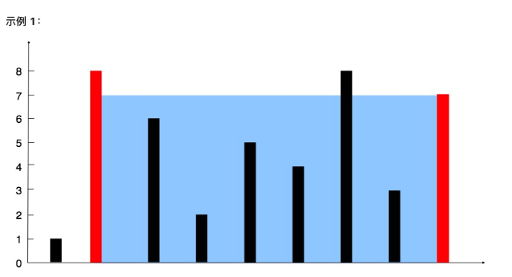

# 11. 盛最多水的容器
#### 难度 中等   `双指针`

::: tip
来源：力扣（LeetCode）

[https://leetcode-cn.com/problems/container-with-most-water][1]

[1]:https://leetcode-cn.com/problems/container-with-most-water
:::

给你 n 个非负整数 a1，a2，...，an，每个数代表坐标中的一个点 (i, ai) 。在坐标内画 n 条垂直线，垂直线 i 的两个端点分别为 (i, ai) 和 (i, 0) 。找出其中的两条线，使得它们与 x 轴共同构成的容器可以容纳最多的水。

**说明:** 你不能倾斜容器。

**示例 1：**
<div align="center">
 
</div>

```
输入：[1,8,6,2,5,4,8,3,7]
输出：49 
解释：图中垂直线代表输入数组 [1,8,6,2,5,4,8,3,7]。在此情况下，容器能够容纳水（表示为蓝色部分）的最大值为 49。
```

**示例 2：**
```
输入：height = [1,1]
输出：1
```

**示例 3：**
```
输入：height = [4,3,2,1,4]
输出：16
```

**示例 4：**
```
输入：height = [1,2,1]
输出：2
```
- - -

解答：

``` js
/**
 * @param {number[]} height
 * @return {number}
 */
var maxArea = function(height) {
  if(height.length <0) return -1;
    let max = 0; // 最后要返回的最大值  即面积
    let left = 0, right = height.length -1; // 从最左最右开始，往中间数
    // 最左边的不能大于最右边的
    while(left < right) {
        let curArea = (right - left) * Math.min(height[left], height[right]);
        if(curArea > max) max = curArea;
        // 当最左边的数 比最右边的数大时，这个小的数就换下一个数继续比较，因为换数可能会得到比之前更大的面经
        if(height[left] > height[right]){
            // 右边的数小了，就要往左移，因为目前已经是在最右边了
            right--;
        } else {
            // 反之，左边的数小了，就要往右移，因为目前已经是在最左边了
            left++;
        }
    }
    return max;
};

```

参考:

[B站的 up主： 天使爆破组](https://www.bilibili.com/video/BV15K4y1b7Sm?from=search&seid=5099780322374433076)
