## 使用 宝塔面板快捷部署项目

<div align="center">
 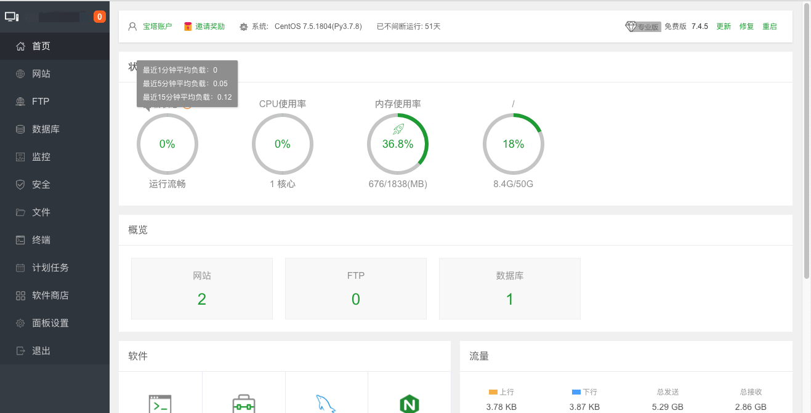
</div>

<div align="center">
 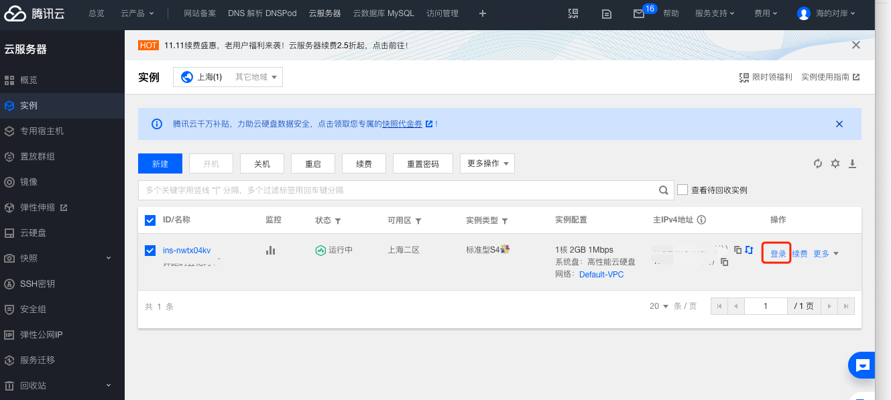
</div>

<div align="center">
 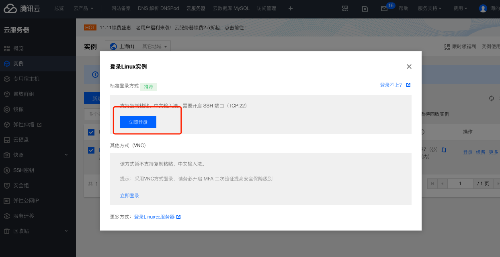
</div>

<div align="center">
 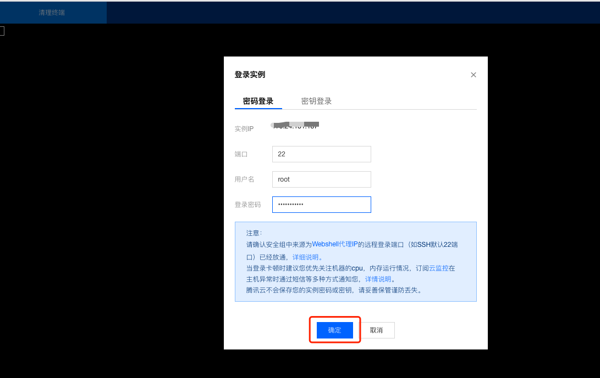
</div>

我的服务器是 Centos, 登陆服务器之后 终端执行
```
yum install -y wget && wget -O install.sh http://download.bt.cn/install/install_6.0.sh && sh install.sh
```
命令跑完之后会出现 会出现快捷登陆的账号密码，如果你忘记了，也没关系
```
在终端输入 查看账号密码
/etc/init.d/bt default
```


我是nodej 部署项目 安装的软件如下
```
1. nginx 1.18.0
2. mysql 8.0.20
3. PHP-7.0
4. Pure-Ftpd 1.0.49
5. phpMyAdmin 4.9
6. PM2管理器 4.2.3
7. Linux工具箱
8. 宝塔SSH终端 1.0
```

<div align="center">
 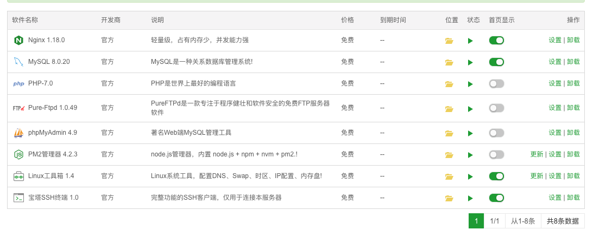
</div>

::: tip
使用宝塔面板参考： https://www.bt.cn/download/linux.html
:::

## MySQL服务器 开启外网访问 远程连接
1. 先在腾讯云服务器上 把3306 的端口 在安全组中开放出来

<div align="center">
 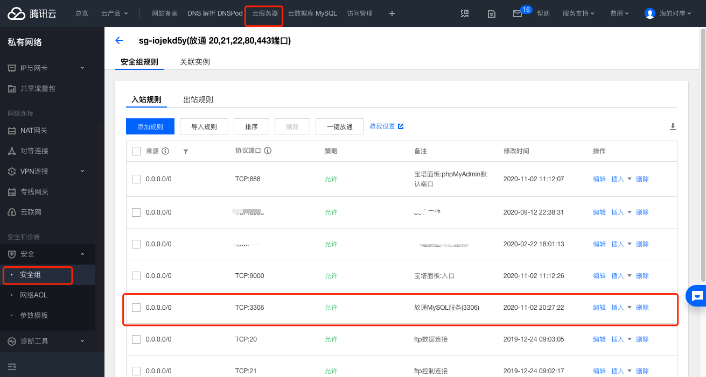
</div>

2. 进入宝塔面板的根目录，更改mysql的设置

mysql用户访问权限(大多数是链接不上是这种情况)

<div align="center">
 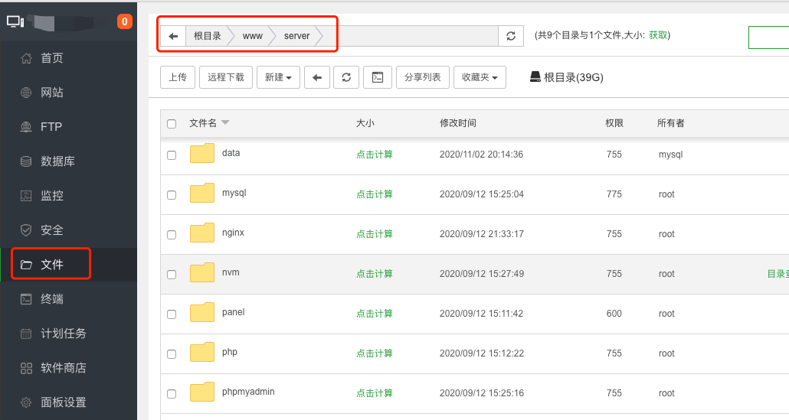
</div>

<div align="center">
 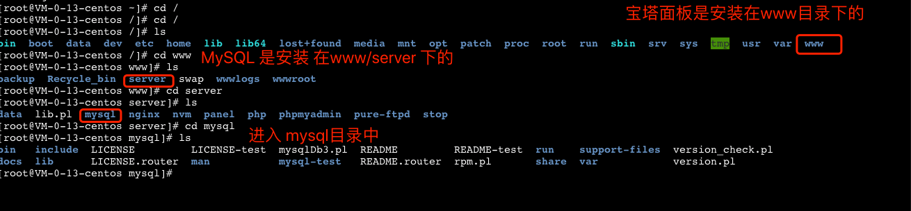
</div>

在命令行中 找到安装的 MySQL路径
``` sql
进入mysql数据库
   $mysql -u root -p
   >use mysql;
 1.>select host,user from user; //查看用户
    MySQL建用户的时候会指定一个host，默认是127.0.0.1/localhost只能本机访问；
    其它机器用这个用户帐号访问会提示没有权限，host改为%，表示允许所有机器访问。
 2.设置host为%
   >update user set host='%' where user = 'root';
    %为任意用户都有权限连接，localhost为只能本机连接，配置完host为%这一步就已经能外网访问了
 3.授权用户具体权限
   >grant all privileges on *.* to 'root'@'%' identified by '123456' with grant option;
   >flush privileges;//刷新权限
 4.删除用户
   >drop user zhangsan@'%';
 
注意: 一定要重启mysql: # systemctl restart mysqld

我的实操 是 走到第三步，然后防火墙开启3306端口即可
```

::: tip
参考：https://blog.csdn.net/qq_36820328/article/details/79654278

第3点的授权命令的解释如下
```
GRANT：赋权命令
ALL PRIVILEGES：当前用户的所有权限
ON：介词
*.*：当前用户对所有数据库和表的相应操作权限
TO：介词
‘root’@’%’：权限赋给root用户，所有ip都能连接
IDENTIFIED BY ‘123456’：连接时输入密码，密码为123456
WITH GRANT OPTION：允许级联赋权
```
:::

3. Linux防火墙开启3306端口

```
firewall-cmd --add-port=3306/tcp
```

<div align="center">
 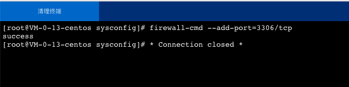
</div>

<div align="center">
 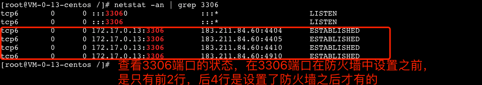
</div>

::: tip
参考：https://blog.csdn.net/drsarah/article/details/90740704?utm_medium=distribute.pc_relevant_t0.none-task-blog-BlogCommendFromMachineLearnPai2-1.channel_param&depth_1-utm_source=distribute.pc_relevant_t0.none-task-blog-BlogCommendFromMachineLearnPai2-1.channel_param
:::

<div align="center">
 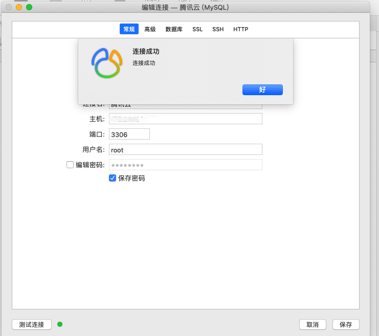
</div>

ps: 如果过了几天，你发现用navicat 连接服务器又报上面的错了，这个时候，你再执行一次 开放防火墙的指令

```
firewall-cmd --add-port=3306/tcp
```

就可以了